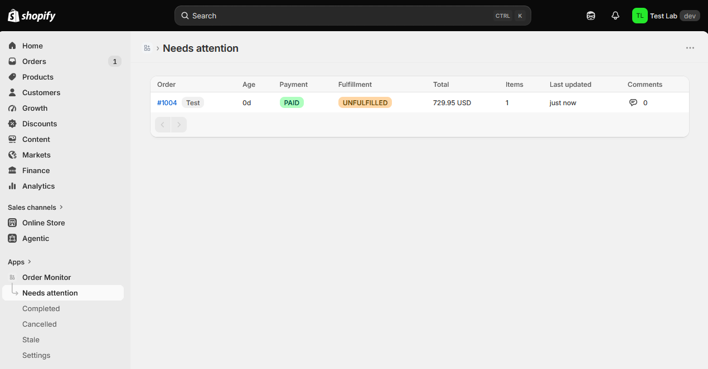
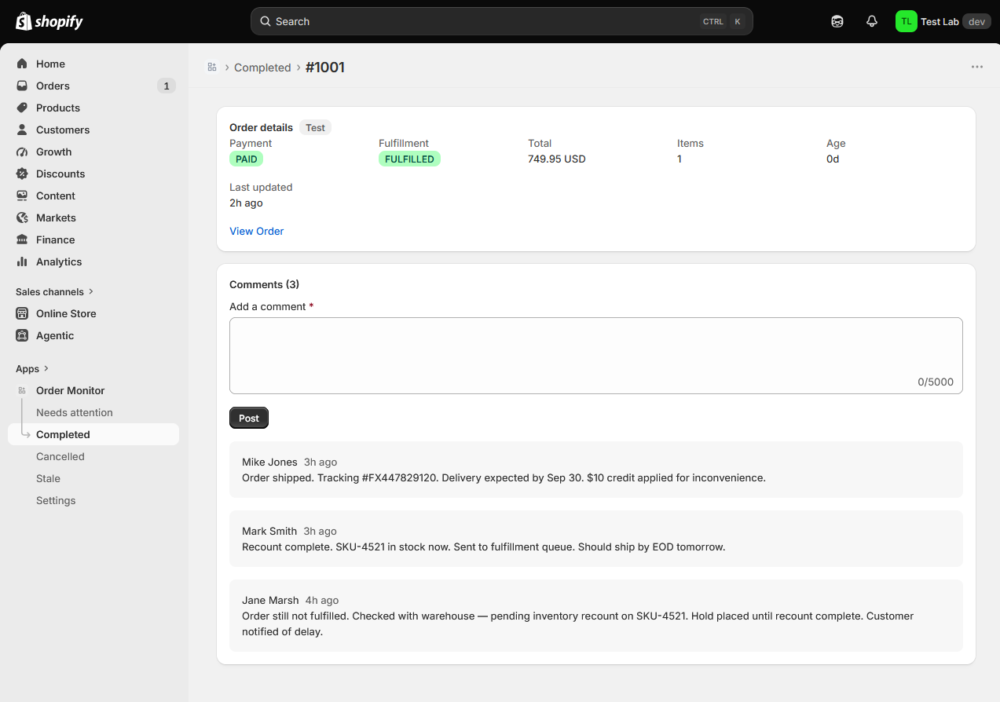

# Shopify Order Monitor

An experimental Shopify app, built primarily as a portfolio piece and as a hands-on
exploration of what's possible when [Claude Code](https://claude.com/claude-code) is used as
the developer. I architected the system myself — the event-driven ingestion pipeline off
Shopify's new Events framework, AWS EventBridge and SQS as the message queue, the multi-tenant
Postgres data model with row-level security, and the order-status/comment/settings design — and
used Claude Code to implement that vision end to end: writing the app and worker, standing up a
proper data model, working through an API surface that's still in developer preview (Shopify's
Events framework, documented but early and changing under it), and verifying the whole pipeline
live against real infrastructure, not just unit tests. The full design log — including mistakes found and fixed by testing against a real
database and a real event delivery — is in [docs/PLAN.md](docs/PLAN.md).

## Contents

- [What it does](#what-it-does)
- [Screenshots](#screenshots)
- [Architecture](#architecture)
- [Requirements](#requirements)
- [Running it locally](#running-it-locally)

## What it does

Order Monitor gives a merchant a single dashboard of every order that hasn't reached a fully
closed state, so nothing unfulfilled or unpaid quietly falls through the cracks. Order data
arrives asynchronously via Shopify's [Events framework](https://shopify.dev/docs/apps/build/events)
(EventBridge → SQS → a worker process), gets normalized and written to the app's own Postgres
database, and the UI always reads from that database — never live from Shopify's API — so the
dashboard stays fast and available even if Shopify's API is slow or rate-limiting.

Events is Shopify's new, next-generation subscription mechanism — announced in 2026 and still in
developer preview on the `unstable` API version — and it's the direction Shopify is moving apps
toward, away from classic webhooks. Instead of subscribing to a broad topic and filtering
relevance in your own handler, Events let you declare field-level triggers, a custom GraphQL query
to shape the payload, and delivery filters directly in `shopify.app.toml`, so you only receive the
data you actually need, only when it changes. Coverage is still limited to a handful of topics
(Product and Customer, with more rolling out through 2026), so most production apps today use
Events alongside classic webhooks rather than instead of them — this project builds on Events
specifically to work with that new surface rather than the well-trodden webhooks path.

Each order is classified into one of four statuses:

- **Needs attention** — anything not yet paid-and-fulfilled, not cancelled, and not closed.
  This is the app's home page and default view.
- **Completed** — closed/archived in Shopify, fully refunded, or paid and fulfilled.
- **Cancelled** — cancelled in Shopify, with a "Refund pending" badge when money is still owed
  back to the customer.
- **Stale (60+ days)** — orders older than the 60-day window `read_orders` can see, shown with
  their last-known values rather than dropped.

Every order also has its own detail page (reached via the comments icon in any list), showing
everything the app knows about that order — payment/fulfillment status, total, item count, age,
last updated, test-order and refund/stale/deleted badges, and a link back to the order in the
Shopify admin. Internal team notes can be left on any order from this page: **comments are
tracked per order**, timestamped and attributed to the staff member who posted them, so a team
can leave context (e.g. "customer contacted, refund in progress") without leaving Shopify.
Comments, and the orders they're attached to, are retained forever for historical record — even
for orders later cancelled, gone stale, or deleted in Shopify — except when a shop is fully
wiped via Shopify's mandatory `shop/redact` compliance webhook.

The four order list pages poll and revalidate every 5 seconds while the tab is visible, so the
dashboard reflects new events without a manual refresh.

## Screenshots

**Needs attention** — the app's home page, listing every order that still needs action:



**Order detail** — payment/fulfillment status, order info, and a timestamped, attributed
comment thread for internal team notes:



### Settings

The settings page (linked from the app nav) controls two things, both stored per-shop and take
effect immediately across all order lists:

- **Age rules** — an arbitrary number of `{ threshold in days, color }` rules used to color-code
  the "Age" column on every order list. Rules are evaluated highest-threshold-reached-wins, so
  you might set 3 days → yellow and 7 days → red to make older unattended orders visually stand
  out. Add, edit, or remove rules freely; a Save Bar appears whenever there are unsaved changes.
- **Show test orders** — a toggle (on by default) for whether Shopify test orders appear in the
  order lists.

## Architecture

```
Shopify Events (developer preview, unstable)
        │  order.displayFinancialStatus / displayFulfillmentStatus / cancellation
        ▼
  AWS EventBridge  →  SQS queue (+ DLQ)
        │
        ▼
  Node/Bun worker (worker/) — sqs-consumer polls the queue, normalizes the
  EventBridge/Shopify envelope (unwrapping payload_url overflow for large
  deliveries), dedups by shopify-webhook-id, guards against out-of-order
  delivery, and upserts the order via a shared write-plan + status-decision
  table (shared/order-status.ts)
        │
        ▼
  Postgres (Prisma) — Shop, Order, OrderComment, ShopSetting,
  ProcessedDelivery, each tenant table scoped by shopDomain and enforced by
  Postgres row-level security (RLS) as well as application-level checks
        │
        ▼
  React Router app (app/) — embedded Polaris/App Bridge UI, reads only from
  Postgres (never live from Shopify) for the four order-status pages, the
  order detail + comments page, and settings
```

The worker and the web app are independent processes that only communicate through Postgres —
the web app never touches SQS, and the worker never touches Shopify's Admin API directly. AWS
infrastructure (the partner event source, event bus, rule, queue, and DLQ) is provisioned outside
this repo; the app only needs the resulting environment variables.

## Requirements

- Node.js `>=20.19 <22` or `>=22.12`, and [Bun](https://bun.sh) (used to run the worker)
- [Docker](https://www.docker.com/) (for the local Postgres database via docker-compose)
- An AWS account with an **EventBridge** partner event source/bus/rule and an **SQS** queue
  already provisioned and wired to receive Shopify Events deliveries (this infrastructure is
  managed outside this repo — the app only needs the queue URL and AWS credentials)
- The [Shopify CLI](https://shopify.dev/docs/apps/tools/cli/getting-started)
- A Shopify app registered in the Partner Dashboard — see
  [shopify.dev's guide to creating an app](https://shopify.dev/docs/apps/build/scaffold-app)
  for how to create one before continuing below

## Running it locally

1. **Start Postgres.** This repo includes a `docker-compose.yml` for local development:

   ```bash
   docker compose up -d
   ```

2. **Configure environment variables.** Copy `.env.example` to `.env` and fill it in:

   ```bash
   cp .env.example .env
   ```

   - `DATABASE_URL` is already set correctly for the docker-compose database — the app connects
     as the non-superuser `app` role (not `postgres`), which row-level security depends on.
   - `SHOPIFY_API_KEY`, `SHOPIFY_API_SECRET`, and `SHOPIFY_APP_URL` are filled in automatically by
     `shopify app config link` (below), or can be set by hand.
   - `AWS_REGION` and `SQS_QUEUE_URL` point at your own AWS infrastructure (see Requirements).
     `AWS_ACCESS_KEY_ID` / `AWS_SECRET_ACCESS_KEY` are optional — omit them to use the default AWS
     SDK credential chain (a local profile, instance role, etc.).

3. **Install dependencies and set up the database:**

   ```bash
   npm install
   npm run setup
   ```

4. **Set up `shopify.app.toml`.** Copy the checked-in template, then link it to the app you
   created:

   ```bash
   cp shopify.app.toml.example shopify.app.toml
   npm run config:link
   ```

   `shopify app config link` fills in `client_id` and `application_url` for the app you select
   (this file is gitignored, since those values — and the AWS ARN below — are specific to your
   own app and AWS account). It does **not** know about your AWS infrastructure, so you'll still
   need to manually replace the `uri` placeholder under `[events]` with your own AWS EventBridge
   partner event source ARN (see Requirements) before running `npm run deploy`.

5. **Run the web app:**

   ```bash
   npm run dev
   ```

   This uses the Shopify CLI to log in, connect a tunnel, and start the dev server. Press `P` in
   the CLI to open your app and install it on a dev store.

6. **Run the worker, in a separate terminal**, to start consuming order events from SQS:

   ```bash
   npm run worker
   ```

   (`npm run worker:peek` is a small script for inspecting what's currently sitting in the queue
   without consuming it.)

### Other useful Shopify CLI commands

```bash
npm run config:use    # switch which linked app config is active
npm run deploy        # deploy app configuration/extensions to Shopify
npm run env            # print the environment variables the CLI has resolved
```
